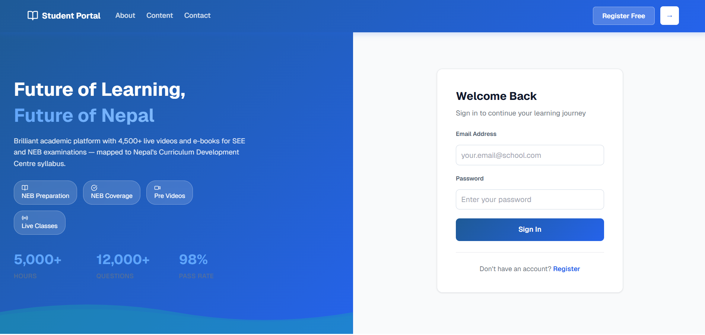
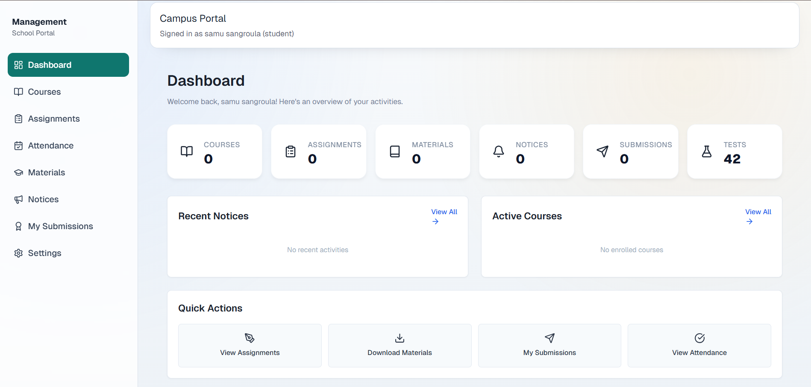

# Student Management System


## What is This Project?

This is a complete system for schools and educational institutions to:
- Manage student information and enrollment
- Track attendance records
- Create and grade assignments
- Manage course materials
- View grades and performance
- Handle user accounts for students, teachers, and admins

## Features

- User authentication with secure login
- Student dashboard to view assignments and grades
- Course management and enrollment
- Assignment submission and grading
- Attendance tracking
- File uploads for course materials
- Role-based access (student, teacher, admin)
- Charts and reports for performance tracking

## Project Structure

```
studentManagementSystem/
├── backend/          - Server and API
├── frontend/         - User interface
└── README.md         - This file
```

## Technology Used

### Backend
- Node.js with Express server
- MySQL database
- Drizzle ORM for database operations
- JWT for user authentication
- Multer for file uploads
- Bcrypt for password encryption

### Frontend
- React for UI
- Vite as build tool
- Tailwind CSS for styling
- React Router for navigation
- Axios for API calls
- Recharts for data visualization
- Shadcn UI for components

## Getting Started

### Requirements
- Node.js (version 14 or higher)
- MySQL database
- npm package manager

### Installation

1. Clone or download this project

2. Install backend dependencies:
```bash
cd backend
npm install
```

3. Install frontend dependencies:
```bash
cd ../frontend
npm install
```

4. Create a .env file in the backend folder with database configuration:
```
DB_HOST=localhost
DB_USER=root
DB_PASSWORD=your_password
DB_NAME=student_management
JWT_SECRET=your_secret_key
```

5. Set up the database:
```bash
cd backend
npm run db:generate
npm run db:push
```

## Running the Application

### Start the Backend Server

In the backend folder:
```bash
npm run dev
```

The API will run on `http://localhost:3000`

### Start the Frontend

In the frontend folder:
```bash
npm run dev
```

The website will open on `http://localhost:5173`

## Usage

1. Open the frontend in your web browser
2. Log in with your account credentials
3. Access different features based on your role:
   - **Students** can view assignments, submit work, and check grades
   - **Teachers** can create assignments, grade submissions, and manage courses
   - **Admins** can manage all users and system settings

## Available Scripts

### Backend
- `npm run dev` - Start server with auto-reload
- `npm start` - Start server normally
- `npm run db:generate` - Generate database changes
- `npm run db:push` - Push database changes

### Frontend
- `npm run dev` - Start development server
- `npm run build` - Create production build
- `npm run preview` - Preview production build

## Database

The system uses MySQL with the following main tables:
- Users (students, teachers, admins)
- Courses
- Enrollments
- Assignments
- Submissions
- Attendance
- Grades

## File Structure Highlights

- `backend/src/server.js` - Main server file
- `backend/src/routes/api.js` - API endpoints
- `backend/src/controllers/` - Request handlers
- `backend/src/models/` - Database models
- `frontend/src/App.jsx` - Main React component
- `frontend/src/pages/` - Page components
- `frontend/src/components/` - Reusable components

## Common Issues

**Cannot connect to database**
- Check if MySQL is running
- Verify database credentials in .env file
- Make sure database exists

**Port already in use**
- Backend uses port 3000
- Frontend uses port 5173
- Close other applications using these ports

**Dependencies installation fails**
- Clear npm cache: `npm cache clean --force`
- Delete node_modules folder and package-lock.json
- Run `npm install` again
